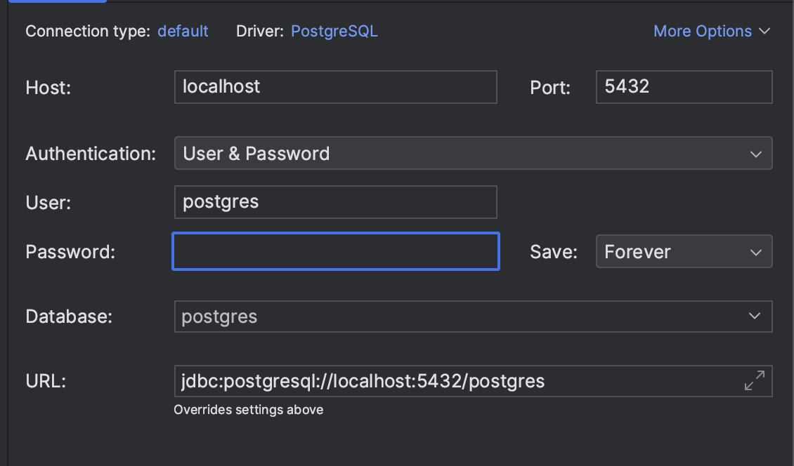

# demo-postgres-databases

Demoing functionality of Postgres and pgAdmin in a local postgres database..

### Overview

- Run Postgres and pgAdmin in Docker using docker-compose
- Image and Containers create the following
    - install pg_stat_statements extension.
    - The ./database/initdb/create_schema.sh create a 'demo' schema and second 'admin' user. The second user is not a superuser.
    - flyway is used to create the tables and insert data into the tables.

### Setup


```bash
# Start the docker file.
make startup
```

Connect to the database using the following credentials:

host: localhost
database: postgres
user: postgres
password: postgres




## Monitoring 

You can use watch to monitor the docker containers. This full command can be found the Makefile of this repository.

```bash
make watch
```


## Backup 

You database is mounted to a volume so the database will persit when close the docker container. You can also backup the database using the following command.

```bash
make backup
```

## Best Practises

- [TBD]

## References

- https://github.com/mrts/docker-postgresql-multiple-databases/blob/master/create-multiple-postgresql-databases.sh
